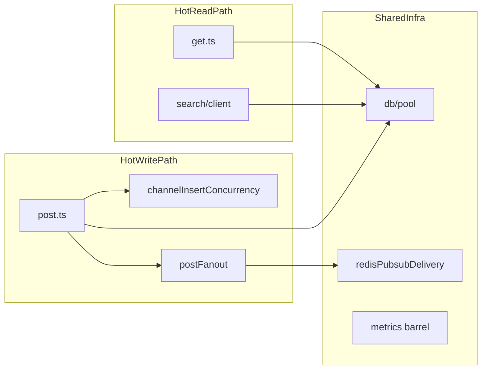

# Backend hotspots (maintainability & throughput risk)

Status: operational  
Owner: backend platform  
Last reviewed: 2026-05-01

Ranked roughly by **frequency on hot paths** × **branching / shared mutable state** × **failure blast radius**. Use this when prioritizing refactors or deciding where to add characterization tests before edits.

**Related:** refactor checklist [`refactor-acceptance-gates.md`](refactor-acceptance-gates.md), metrics [`operations-monitoring.md`](operations-monitoring.md), tunables [`env.md`](env.md).

**Metrics / capacity triage:** Use canonical HTTP series **`http_server_requests_total`**, **`http_server_request_duration_ms`**, **`http_server_requests_aborted_total`** (not `chatapp_http_*`). Reuse existing Prometheus names from [`operations-monitoring.md`](operations-monitoring.md) before inventing new ones. For throughput incidents, prioritize **Postgres pool pressure** and **per-channel insert lock** signals over internal WS **`subscribe_*`** command bursts (join-shaped, not every message).

| Priority | Area | Representative files | Why it matters |
|----------|------|---------------------|----------------|
| 1 | Search execution | [`backend/src/search/client.ts`](../backend/src/search/client.ts), [`backend/src/search/meiliClient.ts`](../backend/src/search/meiliClient.ts), [`backend/src/search/searchExecution.ts`](../backend/src/search/searchExecution.ts), [`backend/src/search/searchQueryEnv.ts`](../backend/src/search/searchQueryEnv.ts) | Replica vs primary retry, overload stages, scoped SQL — wrong branch → empty results or extra DB load. |
| 2 | Realtime delivery | [`backend/src/websocket/server.ts`](../backend/src/websocket/server.ts), [`backend/src/websocket/redisPubsubDelivery.ts`](../backend/src/websocket/redisPubsubDelivery.ts), [`backend/src/websocket/wsAppKeepalive.ts`](../backend/src/websocket/wsAppKeepalive.ts), [`backend/src/websocket/redisPubsubTopicUtils.ts`](../backend/src/websocket/redisPubsubTopicUtils.ts) | Redis→WS path, queues, backpressure — regressions show as tail latency or dropped delivery. |
| 3 | Message posting | [`backend/src/messages/routes/post.ts`](../backend/src/messages/routes/post.ts), [`backend/src/messages/routes/postFanout.ts`](../backend/src/messages/routes/postFanout.ts), [`backend/src/messages/channelInsertConcurrency.ts`](../backend/src/messages/channelInsertConcurrency.ts), [`backend/src/messages/channelInsertLockEnv.ts`](../backend/src/messages/channelInsertLockEnv.ts) | Fanout + insert lock — ordering bugs → duplicates, 503 storms, or Redis/DB skew. |
| 4 | Message reads | [`backend/src/messages/routes/get.ts`](../backend/src/messages/routes/get.ts), [`backend/src/messages/routes/getReadRouting.ts`](../backend/src/messages/routes/getReadRouting.ts) | Pagination/cache/replica routing — mistakes amplify DB read volume per request. |
| 5 | Connection pool | [`backend/src/db/pool.ts`](../backend/src/db/pool.ts) | Circuit breaker and gates touch **every** query — subtle change → widespread 503s or pool exhaustion. **Defer file splits** until gated (see [`refactor-acceptance-gates.md`](refactor-acceptance-gates.md)). |
| 6 | HTTP shell | [`backend/src/app.ts`](../backend/src/app.ts) | Middleware order, overload hooks — ordering bugs affect global behavior. |
| 7 | Metrics registry | [`backend/src/utils/metrics.ts`](../backend/src/utils/metrics.ts), [`backend/src/utils/metrics/`](../backend/src/utils/metrics/) | Mostly re-exports — low runtime risk but **high confusion risk** (duplicate series names, wrong import site). |
| 8 | Reads / receipts | [`backend/src/messages/readReceipt/readReceiptHttpCore.ts`](../backend/src/messages/readReceipt/readReceiptHttpCore.ts), [`backend/src/messages/lib/readReceiptState.ts`](../backend/src/messages/lib/readReceiptState.ts) | Cross-user broadcast semantics — bugs → excess WS traffic or wrong UX. |

Large tests under `backend/tests/` are maintainability debt but do not directly threaten production throughput unless they discourage running the suite.

## Principles (short)

1. **Extract by seam** — stable inputs/outputs (pure helpers, single-phase functions), not arbitrary line counts.
2. **Preserve observability** — metric names/labels and log shapes stay stable unless versioned; align with [`operations-monitoring.md`](operations-monitoring.md).
3. **Throughput needs evidence** — Prometheus snapshots and before/after checklist in [`operations-monitoring.md`](operations-monitoring.md#refactor--optimization-pr-comparison-prometheus).
4. **Pool and overload are global** — treat [`pool.ts`](../backend/src/db/pool.ts) and [`overload.ts`](../backend/src/utils/overload.ts) as high-blast-radius; see refactor gates doc.
