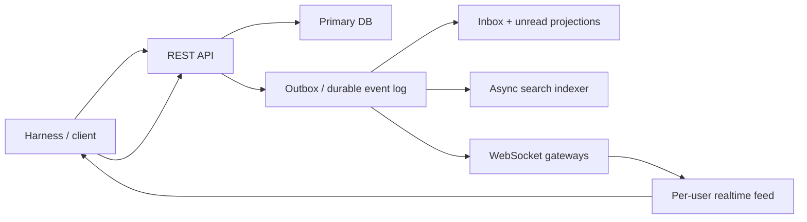

# Realtime Throughput Redesign

This document describes the target architecture we should move toward for
grading throughput and tail-latency reliability, plus a staged migration plan
from the current codebase.

The goal is not to preserve every internal design choice we have today. The
goal is to preserve the external contract that the grader cares about while
removing unnecessary work from the hottest paths.

## Problem statement

The grading harness behaves more like a large synthetic bot swarm than a human
chat client:

- it creates many users
- it opens many conversations and channels
- it expects delivery quickly after successful writes
- it reconnects and churns websocket sessions
- it does not explicitly subscribe to the full set of topics a richer client
  would normally manage

That means the bottleneck is not raw CPU alone. The real risk is tail latency
across:

- request-path DB work
- delivery-path fanout work
- websocket bootstrap breadth
- reconnect races
- read-heavy list endpoints that reconstruct state from relational joins

The current app can remain "mostly idle" at the host level and still miss the
grader's delivery window if one of those paths occasionally stalls.

## Design principles

### 1. User-centric delivery, not topic-centric delivery

For server-managed clients, the canonical realtime contract should be:

- each authenticated socket has one implicit user feed
- the server decides which events the user should see
- the socket receives those events exactly once through that user feed

Explicit `channel:` or `conversation:` subscriptions can still exist for richer
clients, but they should not be the primary delivery path for the grading
client.

### 2. Durable commit first, fanout second

`POST /messages` should succeed once the write is durable and the delivery work
is durably enqueued. It should not depend on every downstream publish
completing inline on the request thread.

### 3. Reconnect replay should be offset-based

Reconnect should ask for "events after sequence N" rather than forcing the
server to scan recent messages by timestamp and visibility rules.

### 4. Hot reads should come from projections

Inbox, unread counts, last-message summaries, and similar list views should be
read from precomputed tables or caches, not reconstructed from large joins on
each request.

### 5. Read receipts are coalesced state

The latest read position matters. Intermediate read transitions usually do not.
We should persist the highest cursor and batch the flush instead of treating
every read request as an important write.

### 6. Non-critical work must never contend with core delivery

Presence, community-wide side notifications, search indexing, and best-effort
background fanout should always yield to:

- message writes
- inbox reads
- reconnect replay
- message delivery

## Target architecture

## External contract to preserve

These are the invariants the migration must not break.

### Message writes

- `POST /api/v1/messages` returns success only after the message is durable
- the message is visible via REST immediately after commit
- realtime delivery arrives quickly enough for the grader to observe it

### Event shape

- websocket event names remain compatible with the grader:
  `message:created`, `message:updated`, `message:deleted`, `read:updated`,
  invite events, and presence events as needed
- payloads continue to expose the fields the client maps today:
  `conversationId`, `channelId`, `authorId`, `content`, timestamps, attachment
  URLs, and aliases where needed

### Reconnect behavior

- reconnect must not silently miss recent committed events
- replay must tolerate short disconnects without requiring the client to
  refetch entire histories

### Read paths

- `/api/v1/conversations`
- `/api/v1/messages`
- `/api/v1/channels`
- `/api/v1/communities`

must remain compatible while moving to cheaper server-side implementations.

## What changes in the target design

### Canonical realtime path

For server-managed sockets, all core events are routed through `user:<userId>`.

That means:

- channel messages no longer need both `channel:<id>` and duplicate `user:<id>`
  fanout for the same server-managed audience
- websocket connect no longer needs to auto-subscribe a socket to every visible
  `channel:`, `conversation:`, and `community:` topic
- connect and reconnect become much cheaper and less race-prone

### Durable outbox

Every write that produces observable side effects also produces an outbox event:

- message created
- message updated
- message deleted
- read state advanced
- conversation membership changed
- channel membership changed, if that remains observable

The request path writes the business rows plus the outbox row in the same
transaction.

Separate workers or gateway consumers handle actual delivery.

### Projection tables

Per-user projections become the source of truth for hot list routes.

Examples:

- `user_inbox_projection`
- `user_channel_unread_projection`
- `user_conversation_unread_projection`
- `conversation_summary_projection`
- `channel_summary_projection`

Each projection should be keyed for the access pattern we actually serve.

### Replay by sequence

Each event delivered through the canonical feed gets a sequence number or
monotonic offset. Reconnect sends:

- the last delivered sequence seen by the socket, or
- a reconnect token that maps to it

The server replays the missing range.

## Migration plan

This is the recommended order. Each phase should ship behind feature flags and
land with telemetry before the next phase begins.

### Phase 0: establish observability

Add end-to-end timing and counters for:

- HTTP request start to DB commit
- DB commit to outbox append
- outbox append to delivery worker pickup
- delivery worker pickup to websocket frame enqueue
- websocket frame enqueue to socket send completion where measurable
- reconnect replay count and replay duration
- number of explicit channel/conversation/community subscriptions per socket
- duplicate-delivery count per event

This phase is mandatory because every later migration should reduce measurable
work, not just change code shape.

### Phase 1: canonical user-feed delivery

Add a feature-flagged path where the gateway treats `user:<userId>` as the
authoritative delivery path for server-managed sockets.

Under the flag:

- the socket always subscribes to `user:<me>`
- core message and read events are emitted to user feeds
- explicit `channel:` and `conversation:` subscriptions still work for clients
  that ask for them

During this phase we may temporarily dual-publish for validation, but we should
measure and minimize the dual-delivery window.

Exit criteria:

- grader-compatible clients can run without relying on broad auto-subscribe
- delivery timeout rate does not regress

### Phase 2: durable outbox on write paths

Replace request-thread delivery coupling with transactionally durable enqueue.

Target write flow for `POST /messages`:

1. validate access
2. insert message and update denormalized pointers
3. insert outbox row for `message:created`
4. commit
5. return success

The request should not wait on broad fanout publish work.

The same pattern should later apply to:

- message edit
- message delete
- read receipt advance
- membership/invite events

Exit criteria:

- no inline fanout work is required for request success
- workers can retry delivery independently of the HTTP request

### Phase 3: projection-backed list routes

Build projections for the hottest routes, starting with
`GET /api/v1/conversations`.

Recommended order:

1. per-user inbox projection
2. per-user unread count projections
3. per-community or per-channel list projections if still needed

The API should read the projection directly. Expensive relational fallback may
remain behind a safety flag during rollout.

Exit criteria:

- `/api/v1/conversations` no longer needs join-heavy reconstruction on every
  request
- p95 for conversation listing is materially lower and flatter

### Phase 4: sequence-based reconnect replay

Once outbox-backed delivery exists, change replay to consume from a durable
recent-event source instead of scanning message tables by time window.

Recommended implementation:

- gateway stores last delivered sequence per socket
- reconnect presents the last seen sequence
- server replays the gap from a capped per-user recent-event store or stream

Exit criteria:

- reconnect no longer depends on expensive access-scoped message scans
- replay latency becomes predictable

### Phase 5: coalesced read-receipt persistence

Move from request-synchronous durable cursor advancement to:

- accept the new high-water mark
- broadcast the latest state immediately
- asynchronously persist the max cursor for the `(user, scope)` pair

If strict write-through semantics are needed for a subset of tests, preserve a
compatibility mode, but the long-term target should be coalesced state.

Exit criteria:

- read storms no longer generate one durable write per user action

### Phase 6: remove redundant topic bootstrap and duplicate fanout

After Phases 1 through 4 are stable:

- disable full auto-subscribe for server-managed sockets
- stop duplicating channel events to per-user topics unless a compatibility
  fallback is explicitly enabled
- keep explicit topic subscriptions only for clients that opt into them

This is where most of the structural waste should disappear.

## Repo-level mapping

This section maps the target plan onto the current codebase.

### Current websocket bootstrap and subscription breadth

Today, broad auto-subscribe logic lives in:

- `backend/src/websocket/server.ts`

Migration direction:

- keep explicit subscribe support
- make user-feed delivery canonical for server-managed sockets
- gradually retire full bootstrap for non-explicit clients

### Current channel message fanout

Today, channel messages use channel topics plus optional user-topic duplicates:

- `backend/src/messages/channelRealtimeFanout.ts`
- `backend/src/websocket/userFeed.ts`

Migration direction:

- send authoritative grader-compatible delivery through user feed
- keep `channel:` only for explicit subscribers
- remove redundant broad user-target lookups from the request path

### Current message write path

Today, request handling and realtime delivery are still closely coupled:

- `backend/src/messages/router.ts`

Migration direction:

- move to message row + outbox append in the same transaction
- let workers/gateways own delivery

### Current conversations list path

Today, `/api/v1/conversations` reconstructs inbox state from joined relational
data:

- `backend/src/messages/conversationsRouter.ts`

Migration direction:

- read from projection tables
- maintain projections asynchronously from outbox events or transaction-side
  updates

### Current reconnect replay

Today, reconnect replay scans messages by time window:

- `backend/src/messages/reconnectReplay.ts`

Migration direction:

- replay by sequence or offset from a recent event store

### Current async side-effect scaffolding

Existing scaffolding that can help with the migration:

- `backend/src/messages/sideEffects.ts`
- `backend/src/messages/messageIngestLog.ts`

Migration direction:

- evolve this toward a real outbox/dispatcher model instead of relying on
  best-effort queueing alone

## Suggested data model additions

These are target concepts, not mandatory final table names.

### Outbox

`realtime_outbox`

- `id`
- `event_type`
- `aggregate_type`
- `aggregate_id`
- `recipient_scope`
- `payload_json`
- `created_at`
- `dispatch_state`
- `dispatch_attempts`

### Per-user recent delivery buffer

`user_realtime_recent`

- `user_id`
- `sequence`
- `event_type`
- `payload_json`
- `created_at`

Retention can be short. It only needs to cover reconnect gaps and grader replay
needs.

### Inbox projection

`user_inbox_projection`

- `user_id`
- `conversation_id`
- `sort_ts`
- `last_message_id`
- `last_message_at`
- `last_message_author_id`
- `unread_count`
- `peer_summary_json`
- `latest_other_read_message_id`
- `latest_other_read_at`

## Feature-flag plan

Use explicit flags so we can stage rollout and compare behavior:

- `REALTIME_CANONICAL_USER_FEED`
- `REALTIME_OUTBOX_ENABLED`
- `REALTIME_OUTBOX_DELIVERY_ENABLED`
- `INBOX_PROJECTION_READS_ENABLED`
- `READ_RECEIPT_COALESCING_ENABLED`
- `WS_SEQUENCE_REPLAY_ENABLED`
- `WS_FULL_BOOTSTRAP_ENABLED`

Recommended rollout style:

- write path dual-write before read-path switch
- delivery path dual-publish before old path removal
- projection build before projection reads

## Success metrics

The redesign is working only if these move in the right direction.

### Delivery reliability

- delivery timeout rate in grader log
- reconnect replay success rate
- delivery lag p95 and p99 from enqueue to socket send

### Request-path latency

- `POST /api/v1/messages` p95 and p99
- `GET /api/v1/conversations` p95 and p99
- `PUT /api/v1/messages/:id/read` p95 and p99

### Efficiency

- average subscriptions per websocket
- duplicate publishes per message
- request-path DB round-trips
- request-path Redis round-trips
- outbox backlog depth

### Safety

- mismatch rate between old and new delivery paths during shadow mode
- projection divergence checks against relational source-of-truth queries

## Non-goals

These changes are not the first priority:

- frontend redesign
- more Node workers by default
- splitting services before the delivery model is fixed
- deep security hardening work unrelated to grading throughput

## Recommended next implementation step

Phase 0 plus Phase 1 should be the next concrete work:

1. add lifecycle telemetry for message delivery and reconnect replay
2. introduce canonical user-feed delivery behind a flag
3. keep explicit topic subscriptions working
4. validate grader compatibility before touching the full outbox migration

That gives us the fastest path to reducing structural waste while keeping the
current product behavior intact.
